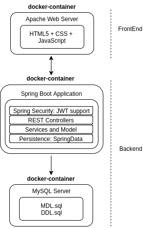

<!-- TOC -->

- [VWS: Video websites scraper](#vws-video-websites-scraper)
    - [1 Arquitectura software](#1-arquitectura-software)
        - [1.1 FrontEnd](#11-frontend)
        - [1.2 Backend](#12-backend)
        - [1.2.1 Aplicacion Spring Boot](#121-aplicacion-spring-boot)
        - [1.2.2 MySQL: Base de Datos](#122-mysql-base-de-datos)
    - [2 Arquitectura de desarrollo](#2-arquitectura-de-desarrollo)
        - [2.1 Construcción, empaquetado y perfiles : maven](#21-construcci%C3%B3n-empaquetado-y-perfiles-maven)
        - [2.3 Como comprobar el API](#23-como-comprobar-el-api)
        - [2.4 Sobre docker y Como generar un entregable para produccion](#24-sobre-docker-y-como-generar-un-entregable-para-produccion)
        - [2.5 Sonarqube: Integracion con Sonarcloud](#25-sonarqube-integracion-con-sonarcloud)
        - [2.6 Pipeline: Integracion con Jenkins pipeline](#26-pipeline-integracion-con-jenkins-pipeline)
        - [2.7 Arquitectura de desarrollo del módulo de FrontEnd](#27-arquitectura-de-desarrollo-del-m%C3%B3dulo-de-frontend)
            - [2.5.1 Tecnologías frontend](#251-tecnolog%C3%ADas-frontend)
            - [2.5.2 Layout del 'frontend'](#252-layout-del-frontend)
            - [2.5.3 Proceso de desarrollo para un 'Frontend Developer'](#253-proceso-de-desarrollo-para-un-frontend-developer)
        - [2.6 Arquitectura de desarrollo de los móduloS de Backend](#26-arquitectura-de-desarrollo-de-los-m%C3%B3dulos-de-backend)
            - [2.6.1 Tecnologias backend](#261-tecnologias-backend)
            - [2.6.2 Layout de la aplicacion backend](#262-layout-de-la-aplicacion-backend)
            - [2.6.3 Proceso de desarrollo para un 'Backend Developer'](#263-proceso-de-desarrollo-para-un-backend-developer)
            - [2.6.4 Test unitarios y de integración en el Backend](#264-test-unitarios-y-de-integraci%C3%B3n-en-el-backend)
            - [2.6.5 Sobre Swagger y la documentacion del API](#265-sobre-swagger-y-la-documentacion-del-api)
        - [2.7 Arquitectura de desarrollo de la BB.DD](#27-arquitectura-de-desarrollo-de-la-bbdd)
            - [2.7.1 Sobre el Modelado y su manteniento](#271-sobre-el-modelado-y-su-manteniento)
            - [2.7.2  Como conectarse a H2 Embebida](#272-como-conectarse-a-h2-embebida)
            - [2.7.3 Como conectarse a MySQL dockerizado](#273-como-conectarse-a-mysql-dockerizado)
    - [4 Nuevas funcionalidades a implementar](#4-nuevas-funcionalidades-a-implementar)
    - [5 Que cosas quiero probar ...](#5-que-cosas-quiero-probar)

# VWS: Video websites scraper #

El proposito de este desarrollo
no es otro que probar, aprender y entender, diferentes técnicas/tecnologías 
de desarrollo de aplicaciones web. 

La funcionalidad/utilidad es lo de meno. El propio principio KISS, se suicidaría si ve como se ha implementado la solución. En cualquier caso, VWS, es una aplicación web de tipo Single Page Application, cuya funcionalidad 
básica consiste en hacer 'scrapping' de portales con enlaces a ficheros 'torrent' 
con peliculas y series de televisión.

## 1 Arquitectura software ##

### 1.1 FrontEnd ###

El 'front' es una aplicación SPA, desarrollada en Javascript, además de HTML5 y CSS3 muy básicos, que lanza peticiones XHR contra una API REST securizada. En general, el formato de intercambio de información, es JSON.

- Las peticiones deben de ir acompañadas del token JWT correspondiente, que nuestro API Rest proporciona a los usuarios que se encuentren dados de alta en la aplicacion. Para obtener el token, se requiere consumir el servicio de /login expuesto en el backend

La aplicación 'front' debe de desplegarse lógicamente, en un servidor web, como puede ser Apache o Node. En nuestro caso, para producción, se empaqueta la aplicación en un contenedor docker con todo lo necesario para su ejecución.

### 1.2 Backend  ###
### 1.2.1 Aplicacion Spring Boot  ###
La lógica de negocio, está desarrollada en Java, con el soporte de spring boot. La arquitectura de esta aplicación es la clásica de capas.

- Securizacion y JWT: La autenticación esta basada en 'token' JWT. El cliente (Frontend, curl, ..etc) se encargará de enviar en sus peticiones, el 'token' JWT que el servidor le ha proporcionado.

Aunque por ser una aplicacion spring boot, no sería necesario, se ha empaquetada en un contenedor docker con todo lo necesario para su ejecución.

### 1.2.2 MySQL: Base de Datos ###

Para la persistencia de los datos (usuarios, favoritos ..), la aplicación Java, se conecta contra una BB.DD MySQL.

Un MySQL "dockerizado" esta preparado con todo lo necesario para su ejecución.

## 2 Arquitectura de desarrollo ##

El proyecto se encuentra alojado en [GitHub](https://github.com/rvillamil/vws). El ciclo de vida del proyecto, está cubierto en general, con el soporte de [maven](https://maven.apache.org)

### 2.1 Construcción, empaquetado y perfiles : maven ###

Se han implementado tres perfiles en el ciclo de vida maven, que se pasan como opción en el parámetro -P

* develop (Perfil por defecto): Lanza los test unitarios y evita los test de integración

* integration: Lanza los test unitarios y los de integracion. Util para entornos de Integración Continua

* docker-support : Ejecuta la 'build' de los contenedores docker en los proyectos dockerizados. En general, se usa para generar una version de produccion.
  
  * NOTA: Requiere un demonio de docker corriendo en la maquina

Ejemplos:

* $mvn clean install : Compila con el profile 'develop' por defecto y lanza los tes unitarios exclusivamente

* $mvn clean install -P integration,docker-support: Ejecuta los test unitarios, los de integración y empaqueta la aplicacion para producción con el soporte de docker

Tenemos dos perfiles, descritos en el application.yml:
- default : Ver script runSpringBootServerWithH2.sh
- container : Se inicia desde un docker (Ver apartado ejecucion desde docker)

### 2.3 Como comprobar el API ###

Las peticiones están securizadas con Spring Secutiry utilizando JSON Web tokens.
Usuarios de prueba:
  rodrigo/pepe
  olga/lola

Para probar:
    # Postman

    # Se lanza una petición de login
    curl -i -H "Content-Type: application/json" -X POST -d '{ "userName": "admin", "password": "password"}' http://localhost:8080/login

    # Con el token JWT que devuelve la peticion anterior, recuperamos los favoritos del usuario 'admin0
    curl -H "Authorization: Bearer xxx.yyy.zzz"  http://localhost:8080/api/favorites/

### 2.4 Sobre docker y Como generar un entregable para produccion ###

 * Levantar el soporte para docker. El entorno de desarrollo/ejecucion
   requiere docker 1.12 o superior
 * Ejecutar $mvn install -P docker-support  OJO! Los contenedores de docker de mysql y tomcat se generan con el plugin de maven!

 * Entrar dentro del proyecto 'vws-docker-support' y ejecutar 'docker-compose up'--> Revisar igual con el script es mejor
 * Ver que la apliacion está iniciada correctamente en:

    - http://localhost:8383/vws-resources-1.0-SNAPSHOT/billboardfilms
    - http://localhost:8383/vws-resources-1.0-SNAPSHOT/

 * Parar con crtl-c y ejecutar un 'docker-compose down'

 * Podemos generar un .war ejecutando un 'mvn package' (o un mvn install por supuesto)
  dentro del proyecto de vws-resources
  El war, esta preparado para desplegar en un tomcat:
  http://localhost:8080/vws-resources-1.0-SNAPSHOT/

 * Podemos generar un contendor docker con la aplicacion autocontenida en un tomcat.
 Para ello ejecutamos el comando: // TODO

 * Entrar dentro de contenedores docker basados en Alpine:  docker exec -it cnt-vws-resources

### 2.5 Sonarqube: Integracion con Sonarcloud  ###
El proyecto se encuentra en: https://sonarcloud.io/organizations/rvillamil-bitbucket/projects
mvn clean install -P integration org.jacoco:jacoco-maven-plugin:prepare-agent package sonar:sonar  -Dsonar.host.url=https://sonarcloud.io  -Dsonar.organization=rvillamil-bitbucket   -Dsonar.login=7750fc9fb8a33d688729a9f94d1943393829294f

### 2.6 Pipeline: Integracion con Jenkins pipeline  ###
// TODO

### 2.7 Arquitectura de desarrollo del módulo de FrontEnd ###
// TODO: La aplicacion frontend, es un módulo mas del proyecto y se llama 'vws-ui'...

#### 2.5.1 Tecnologías frontend ####

- GIT
- Docker/Compse
- json-server/node
- Javascript Vanilla - Frontend
  - HTML5, CSS3
- IDE Visual Studio Code

#### 2.5.2 Layout del 'frontend' ####

El 'layout' es muy básico:
- app
  - home : Pagina principal
  - login : Componente de login
  - modal : Componente con ventanas modales
  - ... (resto de componentes)
- shared : Servicios core, utilidades y configuración compartida
- index.html

#### 2.5.3 Proceso de desarrollo para un 'Frontend Developer' ####

Hay varias formas de trabajar:
1 - Contra un servidor node 'json-server' con datos de pruebas del fichero 'shows.json': $runJSONServer.sh
2 - Contra el backend de 'vws-resources': $ runAWSBackEnd.sh : Esto levanta los contenedores docker

Dentro del directorio test, tenemos un par de scripts

Opcion 1:  $runJSONServer.sh
  Requiere instalada el modulo de node, json-server. Carga el fichero .json para pruebas sin BackEnd en localhost:3000

Opcion 2: $runSpringBootServerWithH2.sh
  Ejecuta el Backend pero contra una BB.DD embebida en h2
  La BBDD se regenera y se destruye en cada arranque o parada.

opcion 3 Como en produccion:
  - docker-compose up para iniciar todos los contenerdos (con -d en background): La aplicación arranca en http://localhost:9090
  - docker-compose stop (o ctrl-c) para pararlos
  - docker-compose down para cargartelo todo
  Para ver la BB.DD :
     mysql vws -P 5306 -uroot -proot -h 127.0.0.1

Para Arrancar la BB.DD solo sin el Backend
    docker-compose up service-bbdd

### 2.6 Arquitectura de desarrollo de los móduloS de Backend ###
#### 2.6.1 Tecnologias backend ####

- GIT
- maven
- Docker/Compose
- MySQL 5.X
- Java 1.8 - Backend
  - Spring Boot
  - log4j2
  - JSoup
  - Swagger
  - lombok
  - jacoco/surefire/failsafe
  - JWT
- IDE eclipse
- Postman

#### 2.6.2 Layout de la aplicacion backend ####

El backend es una aplicación Java, desarrollada en capas, con el soporte de spring boot. Cada capa es un subproyecto que depende de la anterior de la siguiente forma:

 vws-persistence : Capa de persistencia desarrollada con el soporte de 'spring-data'.
- Utilizamos el soporte de H2 embebido, para la fase de desarrollo y pruebas
- Utilizamos el soporte para mysql dockerizado, para producción

- vws-services: Capa con el modelo y los servicios de negocio.

- vws-resources: Capa de controladores, donde exponemos nuestra API securizada con el soporte de 'spring-security', al mundo. Contiene la infraestructura necesaria para generar el backend de la aplicación Web, soporte para Docker incluido.
  - Securizacion y JWT: La autenticación esta basada en 'token' JWT. El cliente se encarga de enviar en sus peticiones, el 'token' JWT que el servidor le ha proporcionado. El 'token' caduca a los 10 dias

#### 2.6.3 Proceso de desarrollo para un 'Backend Developer' ####

Importar el proyecto como proyecto maven en tu editor favorito

 * Lo mejor es arrancar el proyecto como un proyecto spring-boot, ya que las
   spring-devtools nos permiten cambios en caliente

   El ejectuable se encuentra en "Application.java" .
   En Eclipse seria "Run As Java Application".
   En http://localhost:8080

   * Aunque no aporta mucho y genera algun problema, es posbile trabajar
   con un tomcat desde dentro del eclipse, puedes hacer lo siguiente:

 1 - http://stackoverflow.com/questions/34927236/how-to-run-spring-boot-app-in-eclipse-tomcat
 2 - Tener en cuenta que aveces sucede este problema:
   http://stackoverflow.com/questions/31495451/is-there-a-permanent-fix-for-eclipse-deployment-assembly-losing-the-maven-depend

  Pero ademas de que no aporta nada, genera problemas con maven y los faceted projects

#### 2.6.4 Test unitarios y de integración en el Backend #####
// TODO
Nos tomado como referencia:
http://www.baeldung.com/spring-boot-testing?utm_content=buffer61c1e&utm_medium=social&utm_source=twitter.com&utm_campaign=buffer
http://www.springboottutorial.com/unit-testing-for-spring-boot-rest-services
https://docs.spring.io/spring-boot/docs/current/reference/html/boot-features-testing.html

Para hacer test unitarios en los controladores REST:
"When we are unit testing a rest service, we would want to launch only the specific controller and the related MVC Components. WebMvcTest annotation is used for unit testing Spring MVC application. This can be used when a test focuses only Spring MVC components. Using this annotation will disable full auto-configuration and only apply configuration relevant to MVC tests."

#### 2.6.5 Sobre Swagger y la documentacion del API ####
API Rest documentada en la URL siguiente: http://localhost:8080/swagger-ui.html

### 2.7 Arquitectura de desarrollo de la BB.DD ###
#### 2.7.1 Sobre el Modelado y su manteniento ####
- Creamos los objetos del modelo (Account, AccountRepository...) con JPA
- Revisamos el fichero 'application.yml' la opcion de jp: Establecemos a create-drop
- Compilamos la aplicacion (Ver enlace mas arriba)
- Lanzamos la aplicacion como para produccion
- Ejecutamos el script: backup-DDL.sh
- Copiamos el fichero resultando: $cp 00-vws-ddl.sql src/main/docker/vws-mysql/src/00-vws-ddl.sql

#### 2.7.2  Como conectarse a H2 Embebida #####

Esta informacion la tenemos en el application.yml

- http://localhost:8080/h2
- user: root
- pass:
- JDBC URL: jdbc:h2:mem:db;DB_CLOSE_DELAY=-1

#### 2.7.3 Como conectarse a MySQL dockerizado #####
- docker exec -i -t cnt-vws-mysql /bin/bash
- mysql vws -uroot -proot

## 4 Nuevas funcionalidades a implementar ##

 * Automatizar la descarga de pelis cuando salgan en una calidad determinada.
     Por ejemplo, “Reservar Spiderman” y cuando "Spiderman" salga y ademas en la calidad que pongamos, la pondrá a descargar.

 * Poner las notas de las pelis:
    - Implementar el parser de filmaffinity o bien http://www.cinesift.com/
    - Usar una API pública de metracritic o similar ( https://www.publicapis.com/ )

## 5 Que cosas quiero probar ... ##
 
 * Revisar la configuracion de spring boot y la carga de properties mas interesantes
      - https://docs.spring.io/spring-boot/docs/current/reference/html/common-application-properties.html
      - http://www.baeldung.com/spring-boot-application-configuration

 * Montar el CAS con Soporte para Oauth, JWT...etc e integrarlo
      - En mi Sandbox tengo montado un CAS. Faltaría dockerizarlo
      - Autorizacion con OAuth2: https://spring.io/guides/tutorials/spring-boot-oauth2/
      - Ver esta documentacion: https://spring.io/guides/tutorials/spring-security-and-angular-js/

 * Roles a la aplicacion:
     - http://www.baeldung.com/role-and-privilege-for-spring-security-registration
     - https://github.com/spring-guides/tut-bookmarks
     - https://spring.io/guides/tutorials/bookmarks/#_securing_a_rest_service

 * Montar un API Gateway/Manager en el que delegar la autenticacion/autorizacion
     - https://getkong.org/about/ --> https://programar.cloud/post/demo-del-api-gateway-kong/
     - https://apiumbrella.io

 * Soporte para la nube Spring Cloud
      - Microservicios, Eureka: https://spring.io/blog/2015/07/14/microservices-with-spring
      - Introducción a la base de datos NoSQL Redis - https://goo.gl/JBqiHE

 * Soporte para Spring Data Redis - https://goo.gl/oegRqu

 * Evitar problemas de concurrencia: Optimistic Lock
      - Charla Gus: https://youtu.be/fZo8Zp2otqQ
      - http://labs.unacast.com/2016/02/25/on-idempotency-in-distributed-rest-apis/
      - https://spring.io/guides/tutorials/bookmarks/
      - Best practices for concurrency control in REST APIs: https://goo.gl/Xqqvii
      - https://stackoverflow.com/questions/30080634/concurrency-in-a-rest-api

 * Revisar la configuracion del apache y el tomcat embebidos
    - https://elpesodeloslunes.wordpress.com/2014/09/07/el-servidor-tomcat-desde-cero-3-configuracion-basica/

 * Probar mutation Testing
      - https://www.adictosaltrabajo.com/tutoriales/mutation-testing-con-pit/
